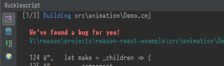
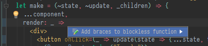

# reasonml-idea-plugin
ReasonML language plugin for idea


## Documentation

Please see the [wiki](wiki).

## Features

|||
|--------------------------------------------|----------------------------------|
|[Reason](https://reasonml.github.io/) syntax<br/>|[OCaml](https://ocaml.org/) syntax<br/>|
|[Dune](https://jbuilder.readthedocs.io/) syntax (limited support)<br/> |Structured view<br/>|
|Code folding<br/>|js language injection<br/>|
|Bucklescript compiler integration<br/>|JSX syntax & completion<br/>|
|Type annotation<br/>|Intentions (_ReasonML_): add braces to function, transform local open<br/>|

- Line and block commenting 
- Pair braces matcher
- Reformat using `refmt` (_press `crtl alt shift R` or `⌘⎇⇧R` on Mac_)
- Reformat on save
- Works natively on Windows

> Make sure `"namespace": false` is set in `bsconfig.json` to enable inferred types hints in the editor.

## Some live templates

List of templates that may help development.

abbrevation: `jsp`, description: `create a jsProps in wrapReasonForJs`
```
~$NAME$=jsProps##$NAME$,$END$
```

abbreviation: `style`, description: `create a style module`
```
module Styles = {
    open Css;
    let $VAR$ = style([
        $END$
    ]);
};
```

abbreviation: `comp`, description: `create a reason component`
```
let component = ReasonReact.statelessComponent("$NAME$");

let make = (~$PROP$, _children) => {...component, render: _self => <div />};
$END$
/*
 JS interop
 expose an helper for js - can be deleted when no more used by javascript code
 */
let jsComponent =
  ReasonReact.wrapReasonForJs(~component, jsProps =>
    make(~$PROP$=jsProps##$PROP$, [||])
  );
```

## What?

- Why don't you consider using Language Server Protocol ?

  Mainly because I want a strong integration in the IDE and I need a first class support of Windows.

- What versions does the plugin support at the moment?

  It should work with idea 15

- How is it different than [ocaml language plugin](https://github.com/sidharthkuruvila/ocaml-ide)?

  I wanted to have a plugin dedicated to reason and that's why I created one called reasonml, not ocaml.
  Then I realised that I still need ocaml support and that people are asking for it.
    
  I started this plugin by studying and copying parts of the ocaml plugin, but now the 2 projects are taking different orientations, technically.
    
  I am moving away from merlin and trying to use the most of Intellij structures.
    
  Now, they have incompatible implementations, and different goals. 

## How to help

- Be patient
- Give this project some love, star it or star the plugin page in [intellij repository](https://plugins.jetbrains.com/plugin/9440-reasonml-language-plugin)
- Fill the github repo with specific issues
- <a href="https://liberapay.com/hgiraud/donate"></a> Support my work

## Development

This project is heavily inspired by :
- [custom language tutorial](http://www.jetbrains.org/intellij/sdk/docs/tutorials/custom_language_support_tutorial.html) from intellij
- [ocaml language plugin](https://github.com/sidharthkuruvila/ocaml-ide) from sidharthkuruvila ( :+1: )
