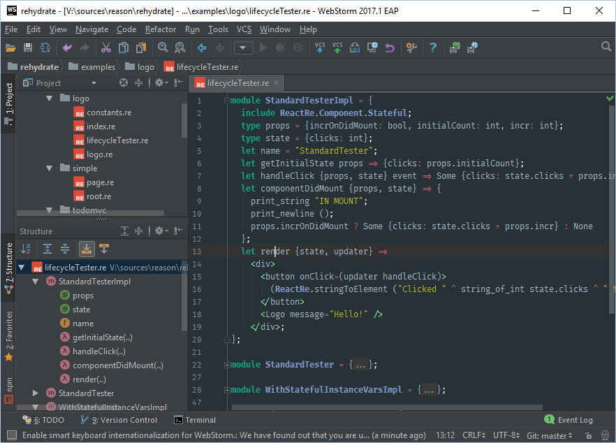

# reasonml-idea-plugin
ReasonML language plugin for idea



## Status

:exclamation: This is a **work in progress**, the language has very basic - and partially implemented - functionalities.

## Features

- Structured view
- Syntax highlighting
- Line commenting with ctrl-alt-l
- code folding
- pair braces matcher
- reformat on save (*)
- Type annotation (* merlin)
- Completion (* merlin)

_(*) See integration_

## Screenshots

Type annotations (linux only):


Reformat on save (Ctrl+s)


## Integration

Integration with reason tools need to be explicitly set with VM properties.

Note: To edit your `idea[64].vmoptions` you can do it from the console, 
or via the menu `help > Edit Custom VM Options`. 

### Linux

- Install [reason-cli](https://github.com/reasonml/reason-cli)
- Edit your `idea[64].vmoptions`
- Add the following properties:
```properties
-DreasonMerlin=<absolute path to node>/bin/ocamlmerlin
-DreasonRefmt=<absolute path to node>/bin/refmt
```

### Windows

- Add `bs-platform` to your project
- Edit your `idea[64].vmoptions`
- Add the following properties:
```properties
-DreasonRefmt=<absolute path to your project>/node_modules/bs-platform/bin/refmt.exe
```

## Development

This project is heavily inspired by :
- [custom language tutorial](http://www.jetbrains.org/intellij/sdk/docs/tutorials/custom_language_support_tutorial.html) from intellij
- [ocaml language plugin](https://github.com/sidharthkuruvila/ocaml-ide) from sidharthkuruvila ( :+1: )
