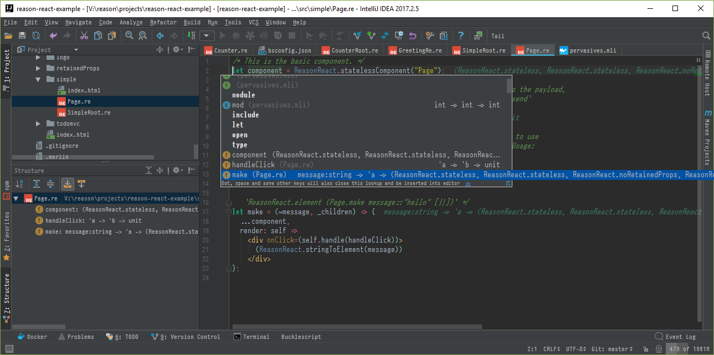

# reasonml-idea-plugin
ReasonML language plugin for idea



## Status

:exclamation: This is a **work in progress**, the language has very basic - and partially implemented - functionalities.
You can look at the [project board](https://github.com/reasonml-editor/reasonml-idea-plugin/projects/1).

This code might change quite a lot or break in the future.

Known limitations:
- idea project must be created at sources root directory (you can't have sources in `somewhere/app/` and project files in `somewhere/project/`)

## Features

- Reason syntax, OCaml syntax (limited support)
- Structured view
- Syntax highlighting
- Line commenting with ctrl-alt-l
- code folding
- pair braces matcher
- JSX completion
- bucklescript compiler integration
- reformat (press `crtl alt shift R` or `⌘⎇⇧R` on Mac)
- reformat on save (use -DreasonReformatOnSave=true in idea[64].vmoptions)
- Type annotation (* bs)

_(*) See integration_

This plugin offer a lightweight integration for Ocaml files.

## Screenshots

Type annotations:


Reformat using refmt(3)


Bucklescript window


## Bucklescript

Advanced features, like syntax error highlighting or type annotations require the installation of [Bucklescript](https://bucklescript.github.io/).

Bucklescript has an excellent support of Windows. 

Note: To edit your `idea[64].vmoptions` you can do it from the console, 
or via the menu `help > Edit Custom VM Options`.

Note: Make sure `"namespace": false` is set in `bsconfig.json` to enable inferred types hints in editor.

### Local installation

- Install bucklescript locally to your project using npm or yarn
- Start idea 

The plugin will find and use the binaries found in the `node_modules/bs-platform` directory.

> *Tip*: if you can, prefer a local installation... you won't have to configure anything else

### Global installation

- Install bucklescript globally
- Edit your `idea[64].vmoptions`
- Add the following properties:
```properties
-DreasonBsb=<absolute_path>/bsb.exe
-DreasonRefmt=<absolute_path>/refmt3.exe
```
- Start idea

The plugin will use the binaries defined in the properties (they might be bundled with plugin in the future).

## Some live templates

List of templates that may help development.

abbrevation: `jsp`, description: `create a jsProps in wrapReasonForJs`
```
~$NAME$=jsProps##$NAME$,$END$
```

abbreviation: `style`, description: `create a style module`
```
module Styles = {
    open Css;
    let $VAR$ = style([
        $END$
    ]);
};
```

abbreviation: `comp`, description: `create a reason component`
```
let component = ReasonReact.statelessComponent("$NAME$");

let make = (~$PROP$, _children) => {...component, render: _self => <div />};
$END$
/*
 JS interop
 expose an helper for js - can be deleted when no more used by javascript code
 */
let jsComponent =
  ReasonReact.wrapReasonForJs(~component, jsProps =>
    make(~$PROP$=jsProps##$PROP$, [||])
  );
```

## What?

- Why don't you consider using Language Server Protocol ?

Mainly because I want a strong integration in the IDE and I need first class support of windows OS.

- What versions does the plugin support at the moment?

It should be work with idea 15

- How is it different than [ocaml language plugin](https://github.com/sidharthkuruvila/ocaml-ide)?

I wanted to have a plugin dedicated to reason and that's why I created one called reasonml, not ocaml. 

Then I realised that I still need ocaml support and that people are asking for it.

I started this plugin by studying and copying parts of the ocaml plugin, but now the 2 projects are taking different orientations, technically. 
I am moving away from merlin and trying to use the most of Intellij structures. 

Now, they have incompatible implementations, and different goals. 

## How to help

- Give this project some love, star it or star the plugin page in [intellij repository](https://plugins.jetbrains.com/plugin/9440-reasonml-language-plugin)
- Fill the github repo with specific issues
- <a href="https://liberapay.com/hgiraud/donate"></a> Support my work
- Be patient

## Development

This project is heavily inspired by :
- [custom language tutorial](http://www.jetbrains.org/intellij/sdk/docs/tutorials/custom_language_support_tutorial.html) from intellij
- [ocaml language plugin](https://github.com/sidharthkuruvila/ocaml-ide) from sidharthkuruvila ( :+1: )
