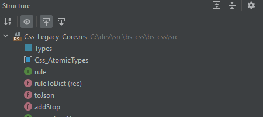

# reasonml-idea-plugin
[**reasonml-editor.github.io/reasonml-idea-plugin**](https://reasonml-editor.github.io/reasonml-idea-plugin/)

ReasonML language plugin for IDEA. Supports Reason, ReScript and OCaml.

## Questions / Feedback ❓

Please see the [FAQ](https://reasonml-editor.github.io/reasonml-idea-plugin/docs/faq) page or [report](https://github.com/reasonml-editor/reasonml-idea-plugin/issues/new) an issue.

Also, free to post any questions or feedback in [Discord](https://discord.com/channels/713777184996589580).

## Documentation 📔

Please see the [docs](https://reasonml-editor.github.io/reasonml-idea-plugin/docs).

## Features

    
Reason&nbsp;syntax

    
Ocaml&nbsp;syntax

    
Dune&nbsp;syntax (limited support)

    
Structured view

    

Code folding

js language injection

Bucklescript compiler integration

JSX syntax & completion

Type annotation

Intentions (_ReasonML_): add braces to function, transform local open

Other features:
- Line and block commenting 
- Pair braces matcher
- Reformat using `refmt` (_press `crtl alt shift R` or `⌘⎇⇧R` on Mac_)
- Reformat on save
- Works natively on Windows

> Make sure `"namespace": false` is set in `bsconfig.json` to enable inferred types hints in the editor.

## How to help

- Be patient
- Give this project some love, star it or star the plugin page in [intellij repository](https://plugins.jetbrains.com/plugin/9440-reasonml-language-plugin)
- Fill the github repo with specific issues
-  Support my work with liberapay
-  Support my work with paypal-me

To all the people who have donated, you are awesome !! Really, this is pure anonymous donation and it blows my mind... I'm very grateful and it's kinda stupid but it keeps me motivated. So big thanks.

Many thanks also to the [jetbrains team](https://www.jetbrains.com/?from=reasonml-idea-plugin) who provide me an OSS licence for their product.

