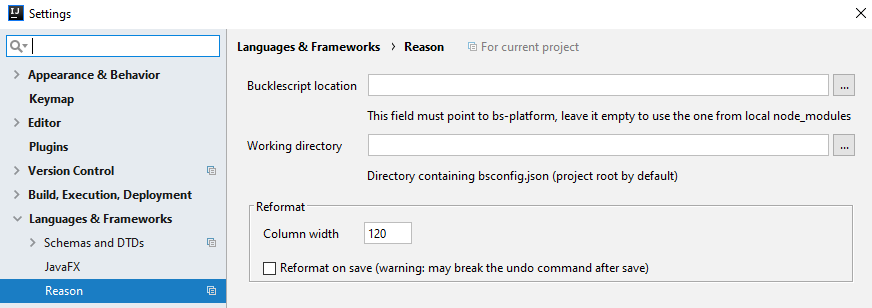

## BuckleScript Settings

Settings are per project.

You can find them in `Project settings | Languages & Frameworks | Reason`: 

See also: [Project Types - BuckleScript Projects](https://github.com/reasonml-editor/reasonml-idea-plugin/wiki/Project-Types#bucklescript-projects)

### Working Directory Resolution
The working directory is no longer specified via settings. Instead, 
it is determined by searching the project for a `bsconfig.json` nearest
to the active file in the editor. If there aren't any active files,
then the `bsconfig.json` nearest to the project root will be used.

---

# How it works

When you open a project, bsb is automatically called and run a `make-world` command.

Then, each time a file is saved, bsb is automatically called with the incremental compilation mode (ie. no arguments)

If you need it, you can also manually execute a `clean-world make-world` command by using the earth icon in the bucklescript window:

# When files are saved ?

You can find the settings for saving files in Appearance & Behavior:

With idea, files are saved automatically, and you don't know exactly when.
But you can force a save with key shortcut: it is sometimes better because you get feedback more quickly.
