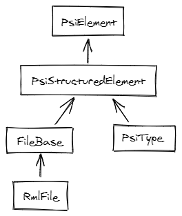
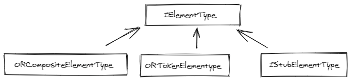
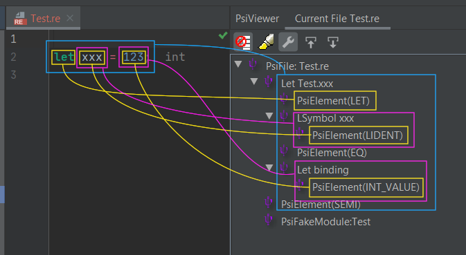
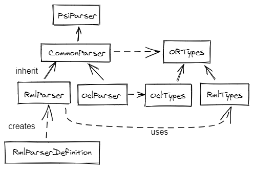
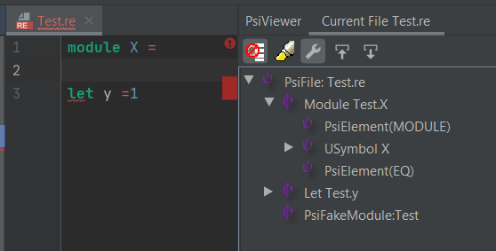
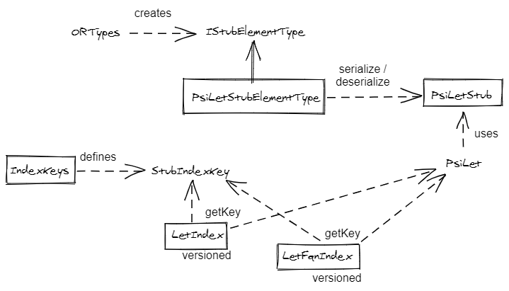
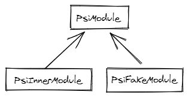
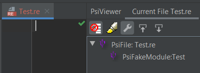
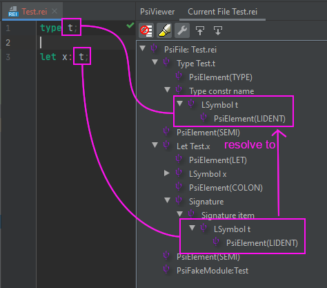
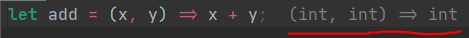

# Design decisions

#### Language Server Protocol, or the lack of

The plugin is not using LSP and there is no plan to use it in the future. I'll try to explain 
the reasoning behind that decision here.

First, plain text editors (VSCode, Textmate, VIM, etc.) and IDE (Jetbrains editors) are
two very different categories. Text editors need additional mechanisms to be able to create
a nice developer experience, including adding semantic to the sources, adding referencing of
symbols for nice navigation, documentation, etc, caching and indexing for fast response.

On the other side, an IDE - as the name implies (Integrated) - already has these behaviors
embedded in the software. With regard to Jetbrains, many man-hours have been invested through
years of development into these exact problems of indexing, referencing, etc. They have their own 
structures (`PSIElement`) that you must follow if you want to use the full power of the IDE.
If you do so, you get a lot of functionalities for free. You won't find many IntelliJ plugins that
are using LSP for - IMO - that exact reason. It would be more integration work if you externalize
the parser or the indexing.

Of course, the drawback of not using LSP is that creating a functional plugin needs more work.

The goal of the plugin is also to work out of the box, and be cross-platform (this is the strength 
of the JVM). The idea is to try to keep things at the JVM level, and thus work at much as possible
at the source level. In a second pass, to improve results, we also use information from the 
compiled typed trees (the cmt files) - but it is optional.

Finally, these decisions give us the ability to provide multiple languages implementations easily:
the plugin works at ReasonML and OCaml source code, and embed Dune, ML4, MLG, MLL, MLY syntax.

#### Language

The plugin is entirely written in Java (only version 8 is supported for now).
Kotlin was not selected for two reasons: Java might be easier for people who
want to contribute occasionally, and Kotlin workflow is much slower than Java.

# Project organisation

The project is built using the [gradle IntelliJ plugin](https://github.com/JetBrains/gradle-intellij-plugin).
The `build.gradle` can be found at the root of the project directory.

Each version of the IntelliJ is developed in its own branch (ex: 191-2019.1, 192-2019.2, etc.).
The main branch is the version just below the latest version (ex: if 2020.1 is the latest released,
the master branch contains the 2019.3 version).

You'll find a `jps-plugin` subproject in the sources.
It was initially created to integrate bucklescript or dune compilation with the normal build process of Idea,
see [external build process.](https://www.jetbrains.org/intellij/sdk/docs/reference_guide/frameworks_and_external_apis/external_builder_api.html)

That work has been canceled for lack of time, but `jps-plugin` is still used for shared elements. 

Structure of the sources is:
- `bs`, `esy`, `dune` contains source code of the corresponding compilers
- `hints` contains source related to Rincewind process
- `ide` contains all editor functionalities
- `lang` contains parser code, PSI definitions, stubs, etc. for the different languages

# Modules

When developing a plugin, you must be aware of the differences between the different products
of the Jetbrains family. 

Not every features are available to the editors (for ex: the JS functionality is not present in
IntelliJ community). Moreover, modules are only exposed in the IntelliJ products.

There are 2 important concepts:
- project: a project is a container for a module. It can have different modules of different types.
It doesn't know about the sources.
- module: a module contains the root sources. They have a type that define what language they accept.

For non-IntelliJ products, the project and the module is a 1-to-1 relation. Even if the module is not
exposed, it is still present and must be used to find the root of the sources.

Plugin functionalities are defined in an xml file that uses extension points of the IDE
to register classes. there are different xml files:
- `plugin.xml`: the main entry, contains all entries common to every product. It also references the other xml files.
- `java-deps.xml`: depends on `com.intellij.modules.java` and is only loaded in IntelliJ products; 
- `js-deps.xml`: special post activities when plugin is used in a javascript editor (ex: webstorm)

# Lexer / Parser

## PsiElement

To know more about Program Structure Interface, go to [Jetbrains SDK doc.](https://www.jetbrains.org/intellij/sdk/docs/basics/architectural_overview/psi.html)

Not only every element of a source code must be described as a PSIElement, but also any element that 
could be used in one of the IDE functionality. For example, all files are also PSI elements: this is needed
to get functionalities like navigation, refactoring, etc.



> Everything is a `PSIElement`, even the files

Every parser must create a tree of `PSIElement`.

You will see three different types in the code: `ORTokenElementType`, `ORCompositeElementType`, and types that inherit from 
`IStubElementType`.



> `OR` prefix means OCaml/ReasonML and is used for shared classes between these two syntaxes

The `ORTokenElementType` are classes generated by the lexer. They are atomic tokens and are always represented as leafs
in the AST.
The `ORCompositeElementType` are classes generated by the parser, by composing tokens from the lexer or other composite 
elements. They will always be nodes in the AST.
The `IStubElementType` are an extended version of a composite element: they will mostly be used in a top level structure
that needs indexing.



> In yellow, the `ORTokenElementType` produced by the lexer, in purple the `ORCompositeElementType` and in blue 
> the `IStubElementType` (in that case, a `PsiLetStubElementType`). 

### Lexer

The lexer is automatically generated from the [JFlex](https://www.jflex.de/) 
file `com\reason\lang\ReasonML.flex`.
 
> If you want to update the generated code, you can `ctrl+shift+g` in the file.

The lexer is used a lot in a performance critical path and must contain the minimum 
of logic to be the most efficient possible.

`ReasonML.flex` is used for the ReasonML language and the OCaml language.
`Dune.flex` (in the same directory) is the lexer used for Dune files.

### Parser

The ReasonML/OCaml parser is entirely coded manually, 
it doesn't use a [Grammar-Kit](https://github.com/JetBrains/Grammar-Kit) grammar.

The first versions of the parser were coded using Grammar-Kit, but we reconsidered
that option due to many problems. The recovery mechanism was very difficult 
to use, and debuging a grammar kit generated parser was not satisfying. Handling two different
languages was also challenging. Plus we wanted to add some semantic and context during the parsing
to help desambiguate the syntax (unfortunately, that point is not really used with the new parser
 neither).



> Generated types are defined in an abstract common class and implemented in two different subclasses.
> Same for the parser, each syntax has its own parser that must produce the same AST of `PsiElement`.

Recovery mechanism is very important, as you can see in the following screenshot. Even if the module expression
is incorrect and not ended, we have correctly identified the next expression as a `let` (see
the AST in the `PsiViewer` window). Even the module is identified as a composite module node, but without the
module binding node.



> Recovery anchors are top level expressions, like `let`, `type`, `switch`, etc.

Also note, that even if it's possible, there are no errors produced by the parser: syntax errors are delegated
to the compilers.

# Indexing

Before we can resolve symbols to their corresponding definition, we need to index them.
Only stub elements are indexed. Again, for everything you want to know about stubs, go to the 
[Jetbrains SDK doc](https://www.jetbrains.org/intellij/sdk/docs/basics/indexing_and_psi_stubs.html).

Stub elements are the serialized versions of the corresponding `PsiElement`. All the stubs are found
in `com.reason.lang.core.stub` and you can see what properties for each stub are saved on disk.

It's important to use the stub instead of the real component whenever possible, to
skip heavy computations, and to avoid IntelliJ to load and parse the real file. For ex,
this is how we use stub:

```java
public String getQualifiedName() {
    PsiModuleStub stub = getGreenStub();
    if (stub != null) {
        // use serialized version of the PsiElement
        return stub.getQualifiedName();
    }
    // else, normal - time consuming - operation
    ...
}
```

In `com.reason.lang.core.stub.type`, you can find the definition of `IStubElementType` for each of the composite 
types that must be serialized (ex: `PsiLetStubElementType`, `PsiModuleStubElementType`, etc). Remember these 
classes are used in `ORTypes` and are the equivalent of a `ORCompositeElementType` class. The `IStubElementType` is where you find the code
for serialization and deserialization of a stub/composite element.

> A stub element can be referenced in different indexes. For example, `PsiLet` is referenced by name and by qualified name.   

All the index are found in `com.reason.ide.search.index`.
 
`com.reason.ide.search.index.IndexKeys` contains the constants that define the indexes you'll see when
using the indices viewer. These constants are used in the stub element types when serializing/deserializing elements. 



> Relations between stubs, keys and indexes

## Virtual namespaces / files

Bucklescript has a directive to automatically generate files with a namespace.

```json
namespace: true | "name"
```

This is problematic when indexing the files at the source level, because the 
namespace only exist at the generated code, and indexing files is different from 
indexing inner modules of a file. Also, we want to use the same indexes for the 
inner modules and for the files. 

To solve these problems, we add a fake element at the end of the file. This 
element implements the `PsiModule` interface, like any other module, and can be indexed
with the same lifecycle.



This is a 'fake' element, because there is no token associated with it.



> An empty file always have a PSI element, the fake element that represents the file itself

If there is a virtual namespace, the qualified name of the `PsiFakeModule` will contain it.

# Resolving

For advanced functionalities in the editor, a symbol must be resolved to its definition.

Only `PsiLowerSymbol` and `PsiUpperSymbol` can be resolved. As you can see in the next screenshot,
every token that may need a resolution must be wrapped with one of these composite element.



> In that screenshot, `PsiElement(LIDENT)` is the token returned by the lexer (the `t` itself),
> and `LSymbol` is the `PsiLowerSymbol` wrapped around that token in order to add resolution.

There are two classes associated with them: `PsiLowerSymbolReference` and `PsiUpperSymbolReference`.
This is where resolution happens.

When resolving a symbol, the first thing is to build a list of potential paths for qualified name.
Ex: file `Foo.re`
```reason
open M1;

module M2 = {
  include M3;
  x()
}
```

When user control-click on x, we need to resolve (find) its definition: we start at `x` and move backward
up until the start of the file, and build a list of paths. Potential paths for this exemple are:
`M3, Foo.M3, M2, Foo.M2, M1, pervasives`.

The class that extract path is `QNameFinder`.
 
Then, when we have a list of potential qualified names, we use the indices to retrieve the
corresponding `PsiElement` from that key. All the code that get Psi from indices is found
in the `Psifinder` class.

# Type inference

Type inference is the signatures you see next to the code, and it can't be selected:



> That information is retrieved from the `.cmt` files. These files contain the serialized
content of a typed tree after compilation by OCaml.

When a file is saved, it is compiled and that creates a cmt file. A process read that file
, extract type information and store them in a cache in the PsiFile representing the source code
(see `SignatureProvider.SIGNATURE_CONTEXT`). 

We use an additional tool for that: [Rincewind](https://github.com/giraud/rincewind).

Rincewind is a very lightweight implementation of a cmt information extractor. It is downloaded automatically
by the plugin when the corresponding OCaml version is known.

It returns a list of signatures, one per line. ex:
```
Va|1.4,1.5|i|int
Va|2.4,2.5|f|float
```
