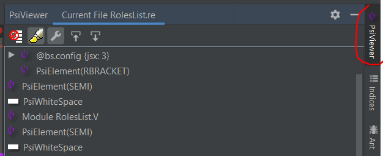
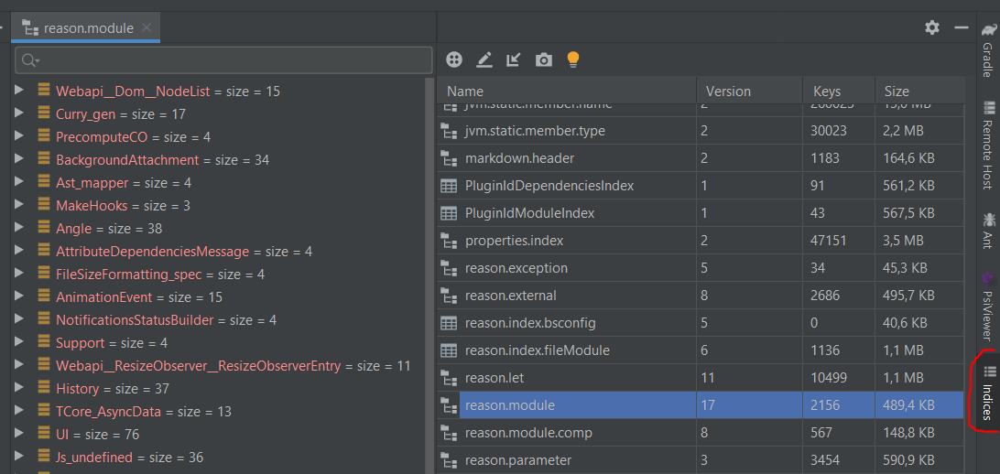

## Local Development

Follow the steps below to get the plugin running locally for development.

### Prepare your Environment

1. Install the [plugin prerequisites](http://www.jetbrains.org/intellij/sdk/docs/tutorials/custom_language_support/prerequisites.html), ensuring that the Plugin DevKit plugin is enabled and [PsiViewer](https://plugins.jetbrains.com/plugin/227-psiviewer) is installed and enabled.  
2. Clone the project `git clone https://github.com/giraud/reasonml-idea-plugin.git`
3. Import the project into Intellij as a Gradle project. This should autoconfigure everything else needed to run the plugin.
4. If prompted, download the Intellij SDK source files. This is useful for debugging the Intellij platform code.

### Run the Plugin

You can launch a new IDEA instance with your development version of the plugin installed with the `runIde` gradle task.


### Troubleshooting

- Verifying that your project is configured to use the **gradle-wrapper.properties** file under **File > Settings > Gradle**.
- Ensure that the **Project SDK** and **Project Language Level** are both set to **Java 11 (Corretto - 11.0.9)** via **File > Project Structure > Project Settings > Project**.

---

## Tools

Two tools are very important for development: the PSIViewer and the Indices viewer.
 
When you start an IntelliJ instance with gradle for debugging, 
they are automatically downloaded for you and immediately available.



> The PsiViewer tool to inspect PsiElements of the generated tree from parser



> The indices viewer tool let you verify the correctness of the indexing

---

## Enable Debug Logs

Debug statements can be found throughout the plugin codebase.
 
Here's an example:
```
private final static Log LOG = Log.create("my-logging-category");

...

if (LOG.isDebugEnabled()) {
  LOG.debug("Log some useful debug information here...");
}
```

These statements are disabled by default. To enable debug logs, do the following:
 1. Launch an instance of IntelliJ + the plugin via the gradle task as described above.
 2. In the newly launched instance (not your development instance) click on **Help > Diagnostic Tools > Debug Log Settings...**
 3. Enter the following, replacing `my-logging-category` with the value provided by the `Log.create(...)` instantiator:
 
    
 4. Debug logs should now be enabled for that logging category. To view the logs, run **Help > Show Log in Files**
 
 > Note: you can run `tail -f idea.log` from a terminal to follow along with the log output.
 
