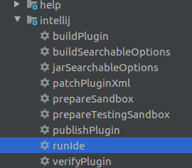
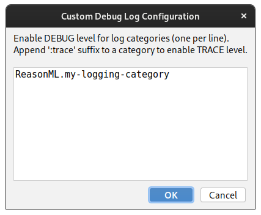

## 📚 Resources for Learning

Below are some resources to help familiarize yourself with IDEA plugin development.

 - [JetBrains Plugin Development Guide](https://jetbrains.org/intellij/sdk/docs/basics/getting_started.html)
 - [JetBrains Plugin Development Forum](https://intellij-support.jetbrains.com/hc/en-us/community/topics/200366979-IntelliJ-IDEA-Open-API-and-Plugin-Development)
 - [JetBrains Platform Slack for Developers](https://intellij-support.jetbrains.com/hc/en-us/community/posts/360006494439--ANN-JetBrains-Platform-Slack-for-Plugin-Developers)
 - [IntelliJ Plugin Repository](https://github.com/JetBrains/intellij-plugins)
 - [OCaml Language Plugin](https://github.com/sidharthkuruvila/ocaml-ide) from sidharthkuruvila ( :+1: )

## Prepare your environment

1. install the plugin prerequisites (from [intellij documentation](http://www.jetbrains.org/intellij/sdk/docs/tutorials/custom_language_support/prerequisites.html))
   1. `git clone https://github.com/JetBrains/intellij-community.git`
   1. install psiviewer plugin
   1. configure an IntelliJ Platform SDK
   1. attach the Community Edition source files to the SDK

## Import

1. clone the plugin project
1. import project from external model, choose gradle
1. select ```use gradle 'wrapper' task configuration``` for easier setup
1. Set project sdk to intellij platform sdk

## Run

You can launch a new idea instance with the run ide gradle task




## Enable Debug Logs

Debug statements can be found throughout the plugin codebase.
 
Here's an example:
```java
private final static Log LOG = Log.create("my-logging-category");

...

if (LOG.isDebugEnabled()) {
  LOG.debug("Log some useful debug information here...");
}
```

These statements are disabled by default. To enable debug logs, do the following:
 1. Launch an instance of IntelliJ + the plugin via the gradle task as described above.
 2. In the newly launched instance (not your development instance) click on **Help > Diagnostic Tools > Debug Log Settings...**
 3. Enter the following, replacing `my-logging-category` with the value provided by the `Log.create(...)` instantiator:
    
 4. Debug logs should now be enabled for that logging category. To view the logs, run **Help > Show Log in Files**
 > Note: you can run `tail -f idea.log` from a terminal to following along with the log output.
 
