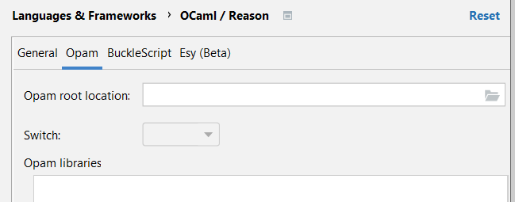
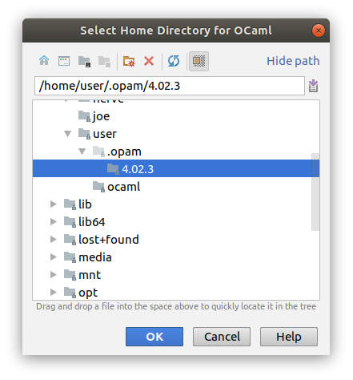
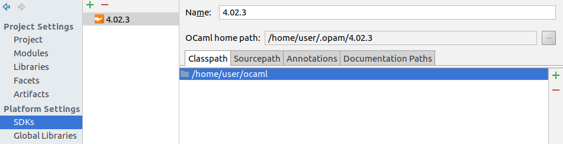
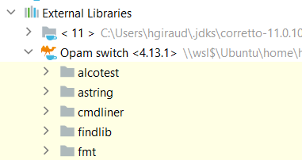
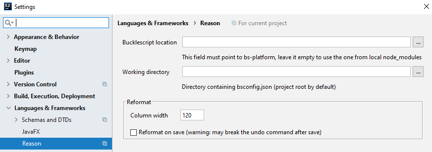

 - OCaml
 - ReasonML (BuckleScript)

---

## OCaml Project Configuration

**prerequesites**: You need one of the IDEA product (community or ultimate).

If you want to have completion and get type annotations, you need to define an SDK.

## Define a SDK

You need to create a SDK to locate the compiled files and the source files of the OCaml language.

First, open the project structure (File | Project structure), and go to SDK:

Locate your ocaml installation:

**NOTE**: SDK version extraction is based on a simple regex and it expects that ocaml installation contains the version number.
If it's not the case, you should probably create a symlink to your real implementation with the version number.

You also need to add the directory of the ocaml sources to get some completion
(You first need to download them from https://github.com/ocaml/ocaml). 
This is needed because the plugin is working at the source level for completion.

Use the + icon and locate the directory where you cloned the github project:

## Set your project SDK

Go to the project entry and select the OCaml SDK:

---

## Reason Project Configuration

Settings are per project.

You can find them in `Project settings | Languages & Frameworks | Reason`: 

