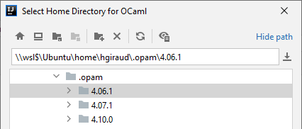
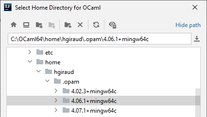
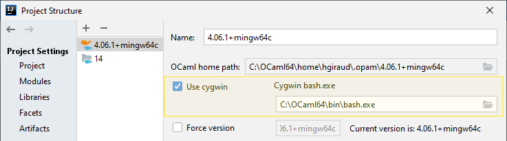
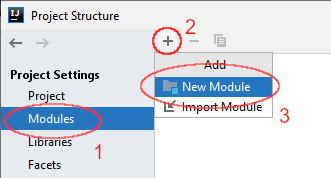
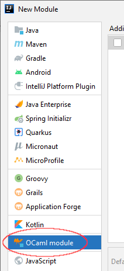
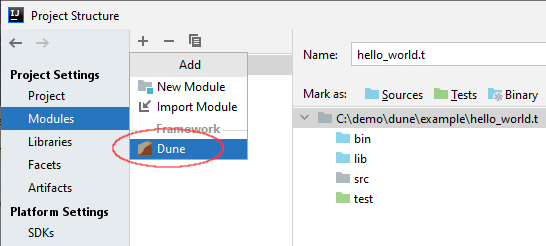
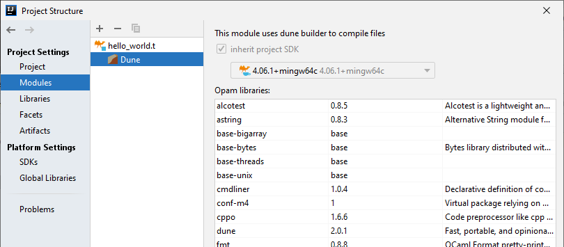

# Configuring an OCaml project

**prerequesites**: You need one of the IDEA product (community or ultimate).

OCaml project follow Java project structures, and need to have a correctly defined 
SDK. The SDK is used to locate the binary files of the OCaml installation.

A SDK is global to a project: it means that you can't mix Java and OCaml in the
same project.

## Define a SDK

First, open the project structure (`File` | `Project structure`), and go to SDK:

Locate your ocaml installation:

- Linux host, using native opam installation   
- Windows host, using WSL   
- Windows host, using Cygwin   

**NOTE**: SDK version extraction uses a very simple regular expression, and it
expects that ocaml installation contains the version number. If it's not the
case, you should probably create a symlink to your real implementation with the
version number.

### Cygwin

Cygwin users must select the `cygwin` checkbox and locate the `bash.exe` binary:

### Sources 

The plugin works at the source level: you need to add language source files to
get completion and references to OCaml structures and functions.

Set the location to where the OCaml sources will be downloaded and extracted,
and then click the `Download sources` button:

When sources have been extracted to the target directory add them to the 
`sourcepath` with the `+` icon (select the directory that has been created under
the download target):

> You can exclude files you don't want completion for

## Set up your project SDK

Go to the project entry and select the OCaml SDK:

## Define an OCaml module

Go to the modules entry and add an OCaml module:

> When importing a project, you may have a generic java module already defined.
> You need to delete it and create an OCaml module instead.
 

the content root must be the directory where the dune-project file is found.

You can then specify the source/test/binary folders:
> This is a manual operation, but it might be more automated in the future 

### Dune facet

To enable dune compilation inside the IDE, and display the dune console, you
need to add a Dune facet to the OCaml module.

