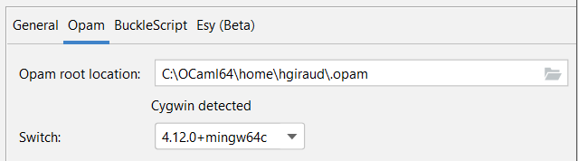
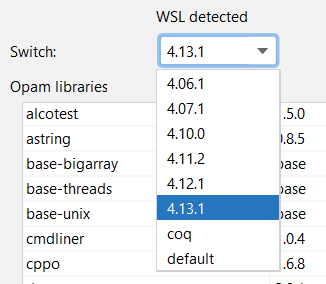
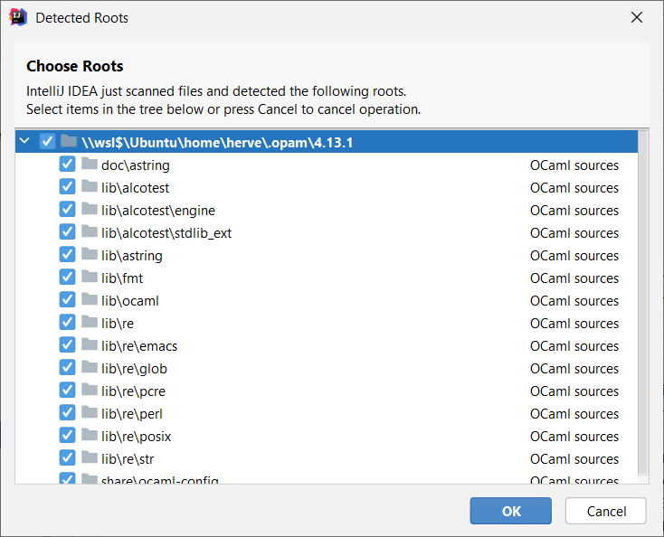
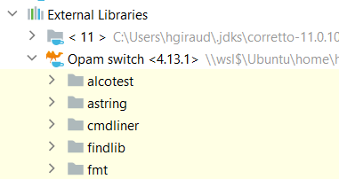
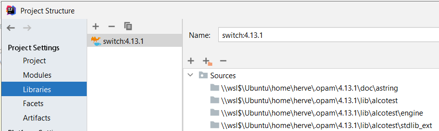

# Configuring an OCaml project

## Define a SDK

The SDK is used to locate the binary files of the OCaml installation.

First, open the project settings (`File` | `Settings`), and go to `Languages & Frameworks` | `OCaml/Reason`:

Locate your ocaml installation, it should be the `.opam` directory in your `home`.

On Windows, if you're using a WSL or a Cygwin installation, 
it should be detected by the plugin:

When opam location is set, switches are listed.

When you select a switch, the installed libraries should be listed.

### Sources 

The plugin works at the source level: when you validate your SDK configuration,
a popup with detected sources will appear:

> You can exclude files you don't want completion for

## Structure

The selected SDK should be displayed as an external library:

Technically, the switch is added as a module library: 
this will automatically index the sources.

This module is always defined, but only visible in major IDE (IC/IU).

